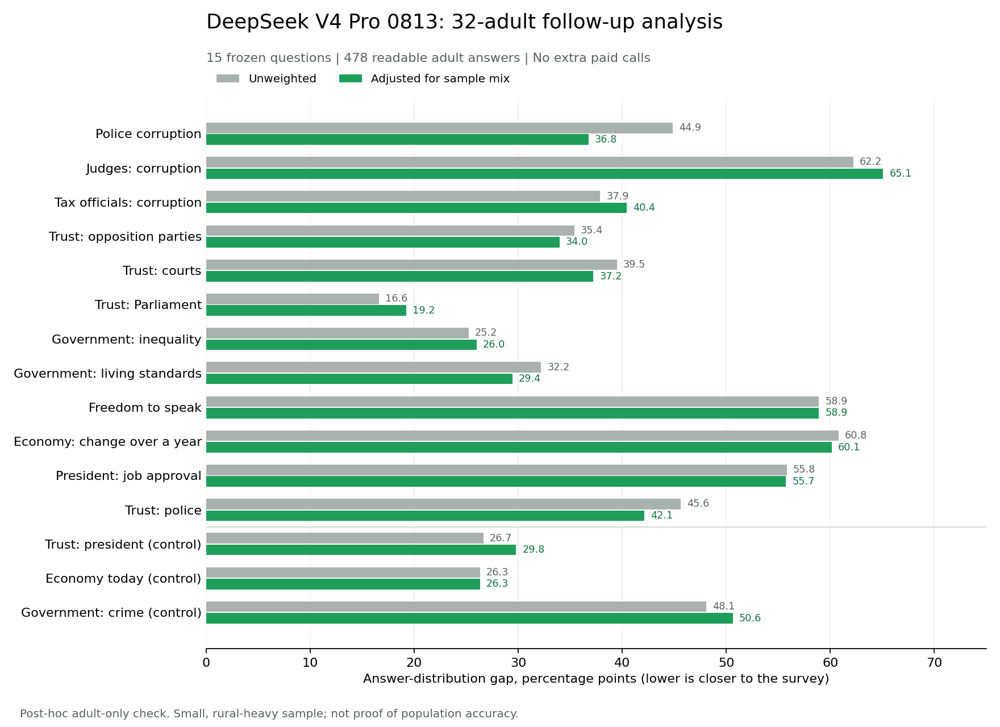

# Paid R10 trial: adult-only follow-up and proof of work

The paid model ran, but the original trial had an eligibility error: **8 of its 40 personas were under 18**, while Afrobarometer R10 covers adults. The original 40-person scores must not be treated as a clean adult-population test.

A separate, free analysis used only the **32 adults already asked**. Their answers still differed substantially from the survey: **42.9 percentage points on average across 12 held-out questions**, or **42.1 points after weighting**. This is a post-hoc sensitivity check, not the originally planned 40-adult trial. No extra model requests were made.

## Adult-only results

| Measure | Unweighted | Weighted |
|---|---:|---:|
| Mean gap, 12 held-out questions | 42.9 pp | 42.1 pp |
| Mean gap, 3 seen controls | 33.7 pp | 35.6 pp |
| Correct urban/rural direction, held-out | 6 of 12 | 6 of 12 |
| Correct urban/rural direction, controls | 1 of 3 | 1 of 3 |

Lower gaps mean a closer mix of answers. These are not percentages of correct people and not an overall validation score.



The 32 adults supplied 480 replies, of which 478 were readable. The same two responses remain unparsed: one omitted the answer line, one embedded it inside prose. No answers were repaired, replaced, or selected based on their values.

## What failed and what was fixed

- **Eligibility failed:** the original room was sampled from all 375 personas. Future R10 seal and preparation steps now exclude under-18s and invalid ages before sampling or fitting weights. There are 330 adults in the current library.
- **The model answers still bunch together:** among adults, 71.9% chose Some of them for police corruption, versus 27.0% in the survey. For judges' corruption, 65.6% chose Don't know/Haven't heard, versus 3.4%.
- **Subgroup predictions remain weak:** the adult-only analysis gets the urban/rural direction right on 6 of 12 held-out questions. Small real gaps and small groups make this count unstable.
- **The sample is still skewed:** the adult subset has 14 urban and 18 rural people. Its weighted urban share is only 43.6%, versus the 71% target. Full-library weights do not make this small room representative.

The original paid run and its scores are preserved, including the ineligible personas: [original report](r10_results_1.md), [original aggregates](r10_results_1.json), and [original chart](r10_gap_chart.png). Its held-out mean gaps were 43.6pp raw and 43.1pp weighted, with urban/rural direction 5/12 and 4/12. Those figures carry the age-eligibility defect and are not the headline adult results.

This trial does not identify whether the model, persona text, stale measured attitudes, sampling, or their combination caused the misses. No comparison model was tested. The larger paid run was not started. A future confirmatory trial needs a newly sealed adult room and a declared sampling/weighting method, without tuning to this test's answers.

## Usage and cost

- Original paid trial: **600 requests**, all successful provider responses; **598 readable answers**.
- Input: **575,145 tokens**. Output: **33,827 tokens**. Total: **608,972 tokens**.
- Estimated cost at the upper listed Singapore snapshot rates: **US$0.8931**. This covers all 600 calls, including the minors; it is not an invoice.
- Adult-only analysis and eligibility repair: **0 new paid requests**.
- Rates used: US$1.32 per million input tokens and US$3.96 per million output tokens. [Provider price page](https://www.alibabacloud.com/help/en/model-studio/deepseek-v4-pro).
- The earlier 9-token connection check is separate. Account discounts and actual billed charges were not verified.

## Method and limits

The original room was sampled once with seed 1 from the local library. It used the real panel profile builder, library guard, mechanism-card attachment and full character-context renderer. The local repaired library loaded fresh with external storage resync disabled. Identities and stored attitudes were not regenerated. Deterministic belief sentences were checked; free-form narratives were retained without semantic validation. The deployed app was not tested.

The adult-only analysis excludes people solely by the survey's age boundary. Audit weights were refitted on all 330 eligible adults, then applied to the 32 adults already in the original sample. Four adult library records have unmapped weighting values. Unsupported R9 race categories (Other 0.2%, Don't know 0.1%) are excluded and supported targets renormalized. Weighted effective sample size is 24.8 people. The remaining demographic skew means neither the raw nor weighted result is a precise national estimate.

All 12 held-out and 3 control questions remain unchanged. Full answer options include don't-know and refusal. Known national totals are normalized for rounding; missing cells are never zero. Subgroups compare Urban minus Rural and Men minus Women on the focus answer selected before calls, with all options reported separately. Missing model answers are counted and excluded from shares.

Held-out means absent from fused survey fields, not proven absent from model training or persona prose. One model and one seed were tested, in non-thinking mode, temperature 0.7, output cap 220 tokens. The adult-only exclusion and weight refit happened after the original outcomes were visible and are explicitly labelled as such.

The earlier identical-people diagnostic remains: 15/15 dimensions had the library-more-predictable direction, with one health-service dimension crossing its warning rule after the education repair. The paid trial does not replace that diagnostic.

## Blind ritual and evidence

The existing `backtest_panel.py` was extended, not forked. Frozen questions had already been committed. New runner and trial settings were committed as `bd223ee` before calls. Seal assembled prompts with external network blocked and did not read the R10 outcome file. Ask read only the sealed prompts, method and SIM credentials. Every attempt and raw response was saved and flushed. The completion receipt was written before a separate reveal process loaded the frozen truth. Raw persona-linked answers and full prompts stay private in ignored files.

Commands used:

```powershell
python backend/scripts/backtest_panel.py --phase seal --n 40 --seed 1
python backend/scripts/backtest_panel.py --phase ask --seed 1
python backend/scripts/backtest_panel.py --phase reveal --seed 1
```

Final ask progress output:

```json
{"completed": 600, "planned": 600, "parsed": 598, "errors": 0, "usage": {"prompt_tokens": 575145, "completion_tokens": 33827, "total_tokens": 608972}}
```

- [Frozen trial method](r10_method_1.json)
- [Saved completion receipt and raw-run hash](r10_receipt_1.json)
- [Detailed question, subgroup and spread report](r10_results_1.md)
- [Full aggregate results](r10_results_1.json)
- [Independent recalculation and input checks](r10_smoke_verification.json)
- [Real offline test output: 52 passed](r10_smoke_tests.txt)
- [Previous identical-people results](REALISM_REPAIR_POW_q94_fixed.md)

An independent recalculation from the saved raw answers reproduced all 15 raw and weighted distribution gaps. All 600 responses named the requested model, returned HTTP 200, and finished normally. Usage sums matched. The local persona file and frozen question files retained their hashes. The isolated checkout also passed 51 tests, with one private-survey test skipped.


## Adult correction evidence

Command:

```powershell
python backend/scripts/backtest_panel.py --phase adult-reveal --seed 1
```

The separate adult report already existed on a repeated invocation, so overwrite protection refused to replace it. Independent recomputation confirmed its contents against the original saved responses; no model calls or original result changes occurred.

- [Detailed adult-only report](r10_results_1_adults.md)
- [Adult-only aggregate results](r10_results_1_adults.json)
- [Independent adult-only verification](r10_adult_verification.json)
- [Final tests: 54 passed](r10_adult_tests.txt)

Future eligibility filtering and the sensitivity path were added after the original run. The pre-call runner remains recorded in commit `bd223ee`; the sealed original method and receipt were not rewritten.

## Honest outside-world paragraph

A first paid trial included eight under-18 personas by mistake. A follow-up analysis of the remaining 32 adults, using only saved answers, differed from South Africa's Round 10 national answer distributions by 42.9 percentage points on average across 12 questions excluded from the personas' fused survey fields, or 42.1 after demographic weighting. It predicted the urban-rural direction correctly on 6 of 12 questions. This small, rural-heavy, post-hoc analysis does not support a claim that the system reliably reproduces public opinion.

The previous pre-paid groundwork report is preserved unchanged in [R10_BACKTEST_GROUNDWORK.md](R10_BACKTEST_GROUNDWORK.md).
