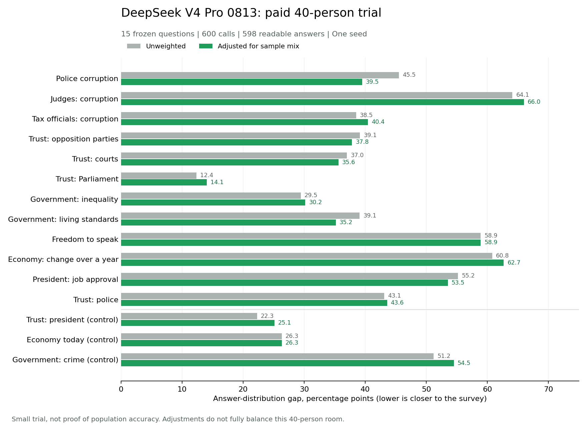

# Paid R10 trial: results and proof of work

The model ran successfully, but the room did not reproduce the survey closely. Across 12 held-out questions, the average answer-distribution gap was **43.6 percentage points**. Weighting changed that to **43.1 points**. Lower is closer to the survey; these numbers are not percentages of correct people or a validation score.

## Results

| Measure | Unweighted | Weighted |
|---|---:|---:|
| Mean gap, 12 held-out questions | 43.6 pp | 43.1 pp |
| Mean gap, 3 seen controls | 33.3 pp | 35.3 pp |
| Correct urban/rural direction, held-out | 5 of 12 | 4 of 12 |
| Correct urban/rural direction, controls | 0 of 3 | 0 of 3 |



All 600 requests returned successfully from `deepseek-v4-pro-0813` through DashScope. There were 598 readable answers. One response omitted the answer line; one placed it inside prose. Both remain unparsed under the frozen parser. No retries or post-hoc repairs were made.

## What failed

- Police corruption: 72.5% of the room chose **Some of them**, versus 27.0% in R10.
- Judges' corruption: 67.5% chose **Don't know/Haven't heard**, versus 3.4% in R10.
- Economy over the past year: 87.5% chose **Worse**, versus 26.7% in R10.
- The room often clustered around a moderate answer or nonresponse and missed the strength and variety of the real answers. Eleven of the twelve held-out items failed the previously declared spread check. This diagnoses output patterns, not their cause.
- Adjusting the demographic mix did not materially reduce the held-out average gap in this trial.

These findings do not establish whether the model, persona text, stale attitudes, question context, or their combination caused the misses. No comparison model was tested. The larger 375-person run was not started; first investigate the recorded failure patterns without changing this frozen test or claiming a pass.

## Usage and cost

- Input: **575,145 tokens**.
- Output: **33,827 tokens**.
- Total: **608,972 tokens** across 600 requests.
- Estimated cost at the upper listed Singapore snapshot rates: **US$0.8931**, excluding any account discounts or billing differences. This is not an invoice.
- Rates used: US$1.32 per million input tokens and US$3.96 per million output tokens. [Provider's model and price page](https://www.alibabacloud.com/help/en/model-studio/deepseek-v4-pro).
- The earlier 9-token connection check is separate from this trial's usage.

## Method and limits

The room was sampled once with seed 1: 40 of 375 personas, including 21 urban and 19 rural, 23 men and 17 women. The local library was loaded fresh with storage resync disabled. The real panel profile builder, library guard, mechanism-card attachment and full character-context renderer were used. Identities and stored attitudes were not regenerated. Deterministic belief sentences were checked; free-form narrative prose was retained without semantic validation. The deployed app was not tested.

Weights were fitted to all six demographic axes in the existing audit on the full library before sampling. Four library records with unmapped values were excluded from weighting. R9 race categories without library support (Other 0.2%, Don't know 0.1%) were excluded and supported targets renormalized. The same full-library weights were retained in the random room. They do **not** make this small sample nationally representative: its weighted urban share is 50.96%, versus the 71% target. Weighted effective sample size is 29.8 people. Both weighted and unweighted findings must therefore remain preliminary.

All 12 held-out and 3 seen-control questions were retained. Full published options, including don't-know and refusal, were offered. Known national totals were normalized for rounding. Missing R10 cells were never converted to zero. Subgroup results compare Urban minus Rural and Men minus Women for the preselected focus answer, with all answer options available in the detailed JSON. Tiny published gaps and small group sizes make sign counts unstable.

Held-out means absent from fused survey columns. It does not prove absence from model training or persona prose. This was one seed and one model in non-thinking mode, temperature 0.7, output cap 220 tokens. It is not a full population test or evidence for a purchase-probability claim.

The preceding identical-people diagnostic remains relevant: 15 of 15 dimensions had the library-more-predictable direction; one health-service dimension crossed its predeclared warning rule after the education repair. This paid trial does not replace that diagnostic.

## Blind ritual and evidence

The existing `backtest_panel.py` was extended, not forked. Frozen questions had already been committed. New runner and trial settings were committed as `bd223ee` before calls. Seal assembled prompts with external network blocked and did not read the R10 outcome file. Ask read only the sealed prompts, method and SIM credentials. Every attempt and raw response was saved and flushed. The completion receipt was written before a separate reveal process loaded the frozen truth. Raw persona-linked answers and full prompts stay private in ignored files.

Commands used:

```powershell
python backend/scripts/backtest_panel.py --phase seal --n 40 --seed 1
python backend/scripts/backtest_panel.py --phase ask --seed 1
python backend/scripts/backtest_panel.py --phase reveal --seed 1
```

Final ask progress output:

```json
{"completed": 600, "planned": 600, "parsed": 598, "errors": 0, "usage": {"prompt_tokens": 575145, "completion_tokens": 33827, "total_tokens": 608972}}
```

- [Frozen trial method](r10_method_1.json)
- [Saved completion receipt and raw-run hash](r10_receipt_1.json)
- [Detailed question, subgroup and spread report](r10_results_1.md)
- [Full aggregate results](r10_results_1.json)
- [Independent recalculation and input checks](r10_smoke_verification.json)
- [Real offline test output: 52 passed](r10_smoke_tests.txt)
- [Previous identical-people results](REALISM_REPAIR_POW_q94_fixed.md)

An independent recalculation from the saved raw answers reproduced all 15 raw and weighted distribution gaps. All 600 responses named the requested model, returned HTTP 200, and finished normally. Usage sums matched. The local persona file and frozen question files retained their hashes. The isolated checkout also passed 51 tests, with one private-survey test skipped.

## Honest outside-world paragraph

On 12 questions excluded from the personas' fused survey fields, a 40-person trial differed from South Africa's Round 10 national answer distributions by 43.6 percentage points on average, or 43.1 after demographic weighting. It predicted the urban-rural direction correctly on 5 of 12 questions, or 4 after weighting. This small, single-seed trial does not support a claim that the system reliably reproduces public opinion.
